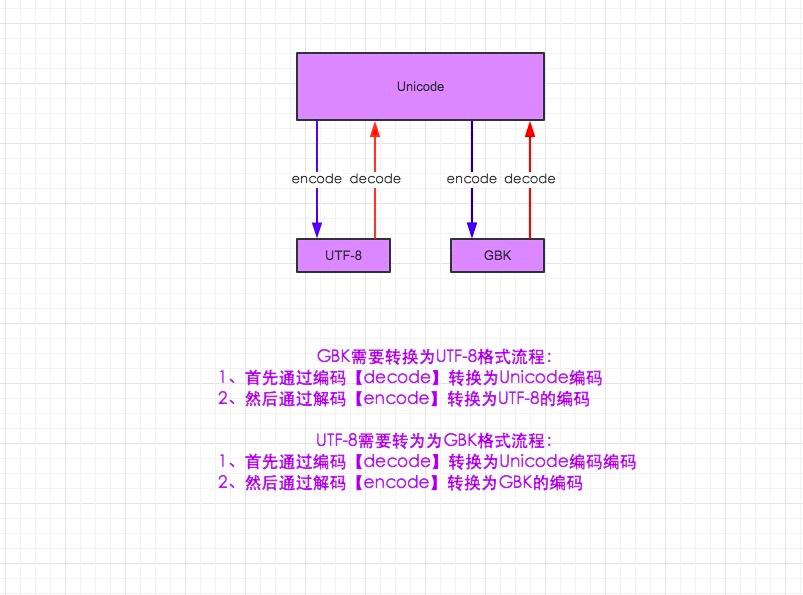

## 第03周-零基础-高级-项目实战最新教程-共19章节  

### 目录  

文件操作、函数  

[第01章节-作业](#第01章节-作业)  
[第02章节-上节内容回顾](#第02章节-上节内容回顾)  
[第03章节-集合及其运算](#第03章节-集合及其运算)  
[第04章节-文件读与写详解1](#第04章节-文件读与写详解1)  
[第05章节-文件读与写详解2](#第05章节-文件读与写详解2)  
[第06章节-文件读与写详解3](#第06章节-文件读与写详解3)  
[第07章节-心灵鸡汤](#第07章节-心灵鸡汤)  
[第08章节-文件修改详解](#第08章节-文件修改详解)  
[第09章节-字符编码转换详解1](#第09章节-字符编码转换详解1)  
[第10章节-字符编码转换详解2](#第10章节-字符编码转换详解2)  
[第11章节-函数与函数式编程1](#第11章节-函数与函数式编程1)  
[第12章节-函数与函数式编程2](#第12章节-函数与函数式编程2)  
[第13章节-函数式编程之参数详解1](#第13章节-函数式编程之参数详解1)  
[第14章节-函数式编程之参数详解2](#第14章节-函数式编程之参数详解2)  
[第15章节-局部变量与全局变量作用域1](#第15章节-局部变量与全局变量作用域1)  
[第16章节-局部变量与全局变量作用域2](#第16章节-局部变量与全局变量作用域2)  
[第17章节-递归](#第17章节-递归)  
[第18章节-函数式编程与函数不同](#第18章节-函数式编程与函数不同)  
[第19章节-高阶函数](#第19章节-高阶函数)  

#### 第01章节-作业  

#### 第02章节-上节内容回顾  
列表有序，可改。元组不可改。字符串不可改。  
列表可以有嵌套任何东西。  
字典中的内容无序列。  

返回: [目录](#目录)  

#### 第03章节-集合及其运算  

实现重复元素的一个去重工作，集合是个好法子。  
集合的两个用途：1.去重。2.关系测试(交集、差集、并集)  

[setTest.py](../../codes/Python-S14/week03/setTest.py)  

```python{.line-numbers}
list_1 = [1,4,5,7,3,6,7,9]
list_1 = set(list_1) #已经是个集合了
```
集合其实也是无序的。  
集合的基本操作：

交集  
```python{.line-numbers}

list_1 = [1,4,5,7,3,6,7,9]
list_1 = set(list_1) #已经是个集合了
#print(list_1,type(list_1))

list_2 = set([2,6,0,66,22,8,4])
print(list_1,list_2)

#交集
print("交集")
print(list_1.intersection(list_2))
print(list_1 & list_2)

#并集
print("并集") 
print(list_1.union(list_2))
print(list_1 | list_2)

#差集 in list1 not in list2
print("差集")
print(list_1.difference(list_2))
print(list_1-list_2)

#子集
print("子集")
list_3 = set([1,3,7])
print(list_3.issubset(list_1))

#父集
print("父集")
print(list_1.issuperset(list_3))

#对称差集 取出两个互相都没有的元素
print("对称差集")
print(list_1.symmetric_difference(list_2))
print(list_1^list_2)

#是否没有交集 没有返回True
print("")
print(list_1.isdisjoint(list_2))
list_4 = set([5,6,8])
print(list_3.isdisjoint(list_4))
```

集合没有插入，但是有添加`add`  
```python{.line-numbers}
list_1.add(999) #添加一项
list_1.update([888,777]) #添加多项
#删除一项
s.remove('H')
s.pop() #无序列的删除
len(s) #看长度
list_1.remove('ddd') #删除存在的变量不存在会报错
list_1.discard('ddd')#删除存在的变量不存在不会报错
```

返回: [目录](#目录)  

#### 第04章节-文件读与写详解1  
#### 第05章节-文件读与写详解2  
#### 第06章节-文件读与写详解3  
#### 第08章节-文件修改详解  
对文件的操作流程：  
1.打开文件，得到文件句柄  
2.通过句柄对文件进行操作  
3.关闭文件  

参照代码：[yesterday.py](../../codes/Python-S14/week03/yesterday.py)  
推荐的文件打开方式：  
```python{.line-numbers}
with open("1.txt","r",encoding="utf-8") as fd:
    pass
#当然也可以打开多个文件
with open("1.txt","r",encoding="utf-8") as fd1,\
     open("2.txt","r",encoding="utf-8") as fd2:
    pass
```

小文件的读取方式：  
```python{.line-numbers}
#这时候f.readlines()是一个列表
for lines in f.readlines():
    print(lines.strip()) #去除多余的 '\n'
```
大文件考虑的读取方式：每次内存中只有一行  
```python{.line-numbers}
#把文件不要当成一个列表，生成一个迭代器
for line in f:
    print(line)
```
获知光标在那里：  
```python{.line-numbers}
f.tell()#现在文件句柄所在的指针指向的地方
f.seek(0)#光标回到0地址，也就是起始地址
f.fileno()#文件句柄在内存中的编号
f.seekabel()#部分文件句柄不一定能移动回去。Linux下面设备也是文件
f.flush()#刷新有的时候缓存机制会有一定延时
```

返回: [目录](#目录)  

#### 第09章节-字符编码转换详解1  
#### 第10章节-字符编码转换详解2   

`unicode` 所有的字符都占2个字节,16位。这意味着，虽然中文可以被支持了。但是对应的英文大小是原来的两倍。造成了不必要的浪费。为此出现了一个unicode的扩展集UTF-8，可变长的字符编码，所有的英文字符依然按照ASCII码的方式编码，所有的中文统一是三个字节。  


py2中的编码转换,上图仅适用于py2  

《[py编码终极版](https://www.cnblogs.com/yuanchenqi/articles/5956943.html)》  

```
需知:
1.在python2默认编码是ASCII, python3里默认是unicode
2.unicode 分为 utf-32(占4个字节),utf-16(占两个字节)，utf-8(占1-4个字节)， so utf-16就是现在最常用的unicode版本， 不过在文件里存的还是utf-8，因为utf8省空间
3.在py3中encode,在转码的同时还会把string 变成bytes类型，decode在解码的同时还会把bytes变回string
```

```python{.line-numbers}
#在 Python2 中 
#-*-coding:utf-8-*-
import sys
print(sys.getdefaultencoding()) 
#打印系统默认编码 ASCII

msg = "我爱北京天安门"
msg_gb2312 = msg.decode("utf-8").encode("gb2312")
#decode不传值就相当于使用默认编码
#decode("utf-8")解码成unicode
gb2312_to_gbk = msg_gb2312.decode("gbk").encode("gbk")

print(msg)
print(msg_gb2312)
print(gb2312_to_gbk)
```

```python{.line-numbers}
#在 Python3 中 
#-*-coding:gb2312 -*-   #这个也可以去掉
import sys
print(sys.getdefaultencoding())
#打印系统默认编码

msg = "我爱北京天安门"
#msg_gb2312 = msg.decode("utf-8").encode("gb2312")
msg_gb2312 = msg.encode("gb2312") #默认就是unicode,不用再decode,喜大普奔
gb2312_to_unicode = msg_gb2312.decode("gb2312")
gb2312_to_utf8 = msg_gb2312.decode("gb2312").encode("utf-8")

print(msg)
print(msg_gb2312)
print(gb2312_to_unicode)
print(gb2312_to_utf8)
```

```python{.line-numbers}
#-*-coding:gbk-*-

s = "你好" 
#这个字符串依然是Unicode编码
#coding:gbk只是表示文件的编码不是字符变量
```
返回: [目录](#目录)  

#### 第11章节-函数与函数式编程1  

本节内容：  
1. 函数基本语法及特性  
2. 参数与局部变量  
3. 返回值  
嵌套函数  
4. 递归  
5. 匿名函数  
6. 函数式编程介绍  
7. 高阶函数  
8. 内置函数  


返回: [目录](#目录)  

